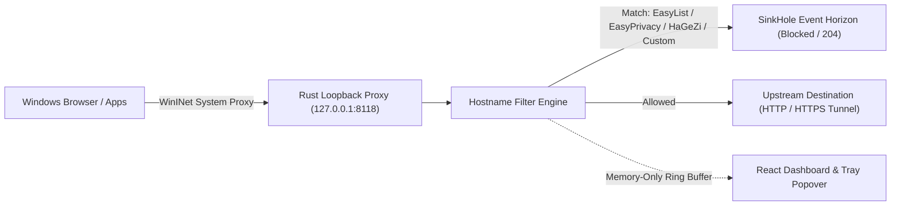

# SinkHole

[](https://v2.tauri.app/)
[](https://www.rust-lang.org/)
[](https://react.dev/)
[](https://www.typescriptlang.org/)
[](LICENSE)

**SinkHole** is a cosmic-themed, local-first privacy proxy for Windows. It routes browser traffic through a high-performance Rust loopback proxy and sends known advertising, tracking, and telemetry destinations into an event horizon before they load.

Built with **Tauri v2**, **Rust**, **React**, **TypeScript**, and **Tailwind CSS**.

---

## System Architecture



---

## Key Features

- **One-Click Windows Proxy Integration**: Connects current-user Windows browser traffic automatically and backs up previous proxy settings for clean restoration on disconnect or tray quit.
- **WARP-Style Tray Popover**: Compact system tray control with a single truthful power switch for both the filter engine and Windows browser routing.
- **Multi-Source Threat & Telemetry Blocking**:
  - **EasyList** — blocks known advertising hosts.
  - **EasyPrivacy** — blocks analytics and tracking hosts.
  - **HaGeZi Windows/Office Telemetry** — blocks native OS and application telemetry endpoints.
  - **Custom Rules & Allowlist** — supports user-defined blocked domains and instant domain allowlisting.
- **Zero-Cert HTTPS Boundary Filtering**: Filters HTTPS `CONNECT` requests at the hostname boundary without installing a root certificate or decrypting traffic.
- **Memory-Only Activity Log**: Displays recently blocked hostnames and live category counters (Ads, Trackers, Telemetry, Custom) without logging full URLs or request payloads to disk.
- **Built-in Connection Verification**: Local `http://sinkhole.test` probe confirms that browser traffic is actively routed through the SinkHole proxy.

---

## Scope & Design Boundaries

SinkHole is a **hostname-level privacy proxy**, not a browser DOM extension:
- It deliberately ignores path-specific and conditional browser filter rules rather than risk over-blocking an entire website.
- It operates at the network hostname boundary and does not perform cosmetic DOM element removal or TLS interception.
- The dashboard reports **Filter Engine** state and **Browser Traffic Routing** state separately, confirming traffic capture only after the proxy observes live requests.

---

## Getting Started

### Prerequisites (Windows)
- **Node.js 18+** and **pnpm**
- **Rust** (stable toolchain)
- **Microsoft Edge WebView2**
- **Visual Studio 2022 Build Tools** (with the C++ desktop development workload)

### Installation & Local Development

```powershell
git clone https://github.com/nnickahh/sinkhole.git
cd sinkhole
pnpm install
pnpm tauri dev
```

### Usage
1. Click **Connect Windows** in the dashboard (or toggle the switch in the system tray popover).
2. Open the **connection test** (`http://sinkhole.test`) to verify your browser is routed through SinkHole.
3. Browse normally and watch **Requests seen** and category counters update in real time.
4. Click **Disconnect** or **Quit SinkHole** from the tray menu to automatically restore your previous Windows proxy settings.

> **Manual Proxy Option:** Browsers with independent proxy configurations (such as Firefox) can be pointed directly to `127.0.0.1:8118`.
>
> **Recovery Note:** If SinkHole is force-terminated while connected, open Windows **Settings → Network & internet → Proxy** and toggle **Use a proxy server** off, or simply relaunch SinkHole and disconnect cleanly.

---

## Verification & Stress Testing

### Build & Unit Tests
```powershell
pnpm check
pnpm build
cargo fmt --manifest-path src-tauri/Cargo.toml --check
cargo test --manifest-path src-tauri/Cargo.toml
cargo test --manifest-path src-tauri/Cargo.toml live_default_lists_contain_more_than_one_hundred_thousand_supported_rules -- --ignored
pnpm tauri build
```
Packaged Windows installers are output under `src-tauri/target/release/bundle/`.

### Live Proxy Stress Harness
With SinkHole running, exercise the proxy against 3,000 concurrent ad, tracker, and telemetry requests:
```powershell
python scripts/stress_test.py
```
The harness verifies a `204` sinkhole response across every category before launching the concurrent load phase.

### Site Compatibility Smoke Test
Verify that standard web destinations resolve cleanly through the proxy:
```powershell
python scripts/site_compatibility.py
```

---

## Author

**Nick Fong** ([@nnickahh](https://github.com/nnickahh))

## License

MIT — see [LICENSE](LICENSE).

