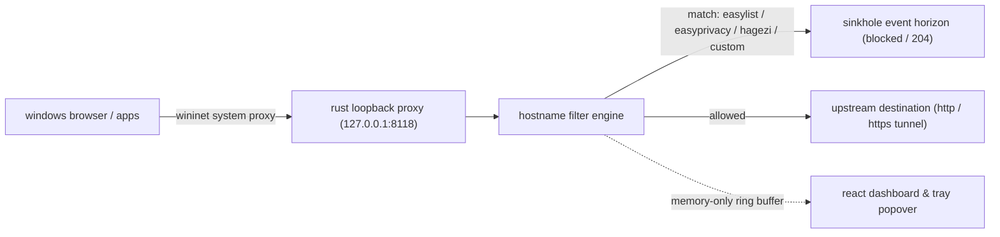

# sinkhole

[](https://v2.tauri.app/)
[](https://www.rust-lang.org/)
[](https://react.dev/)
[](https://www.typescriptlang.org/)
[](LICENSE)

**sinkhole** is a cosmic-themed, local-first privacy proxy for windows. it routes browser traffic through a high-performance rust loopback proxy and sends known advertising, tracking, and telemetry destinations into an event horizon before they load.

built with **tauri v2**, **rust**, **react**, **typescript**, and **tailwind css**.

---

## system architecture



---

## key features

- **one-click windows proxy integration**: connects current-user windows browser traffic automatically and backs up previous proxy settings for clean restoration on disconnect or tray quit.
- **warp-style tray popover**: compact system tray control with a single truthful power switch for both the filter engine and windows browser routing.
- **multi-source threat & telemetry blocking**:
  - **easylist** — blocks known advertising hosts.
  - **easyprivacy** — blocks analytics and tracking hosts.
  - **hagezi windows/office telemetry** — blocks native os and application telemetry endpoints.
  - **custom rules & allowlist** — supports user-defined blocked domains and instant domain allowlisting.
- **zero-cert https boundary filtering**: filters https `CONNECT` requests at the hostname boundary without installing a root certificate or decrypting traffic.
- **memory-only activity log**: displays recently blocked hostnames and live category counters (ads, trackers, telemetry, custom) without logging full urls or request payloads to disk.
- **built-in connection verification**: local `http://sinkhole.test` probe confirms that browser traffic is actively routed through the sinkhole proxy.

---

## scope & design boundaries

sinkhole is a **hostname-level privacy proxy**, not a browser dom extension:
- it deliberately ignores path-specific and conditional browser filter rules rather than risk over-blocking an entire website.
- it operates at the network hostname boundary and does not perform cosmetic dom element removal or tls interception.
- the dashboard reports **filter engine** state and **browser traffic routing** state separately, confirming traffic capture only after the proxy observes live requests.

---

## getting started

### prerequisites (windows)
- **node.js 18+** and **pnpm**
- **rust** (stable toolchain)
- **microsoft edge webview2**
- **visual studio 2022 build tools** (with the c++ desktop development workload)

### installation & local development

```powershell
git clone https://github.com/nnickahh/sinkhole.git
cd sinkhole
pnpm install
pnpm tauri dev
```

### usage
1. click **connect windows** in the dashboard (or toggle the switch in the system tray popover).
2. open the **connection test** (`http://sinkhole.test`) to verify your browser is routed through sinkhole.
3. browse normally and watch **requests seen** and category counters update in real time.
4. click **disconnect** or **quit sinkhole** from the tray menu to automatically restore your previous windows proxy settings.

> **manual proxy option:** browsers with independent proxy configurations (such as firefox) can be pointed directly to `127.0.0.1:8118`.
>
> **recovery note:** if sinkhole is force-terminated while connected, open windows **settings → network & internet → proxy** and toggle **use a proxy server** off, or simply relaunch sinkhole and disconnect cleanly.

---

## verification & stress testing

### build & unit tests
```powershell
pnpm check
pnpm build
cargo fmt --manifest-path src-tauri/Cargo.toml --check
cargo test --manifest-path src-tauri/Cargo.toml
cargo test --manifest-path src-tauri/Cargo.toml live_default_lists_contain_more_than_one_hundred_thousand_supported_rules -- --ignored
pnpm tauri build
```
packaged windows installers are output under `src-tauri/target/release/bundle/`.

### live proxy stress harness
with sinkhole running, exercise the proxy against 3,000 concurrent ad, tracker, and telemetry requests:
```powershell
python scripts/stress_test.py
```
the harness verifies a `204` sinkhole response across every category before launching the concurrent load phase.

### site compatibility smoke test
verify that standard web destinations resolve cleanly through the proxy:
```powershell
python scripts/site_compatibility.py
```

---

## author

**nick fong** ([@nnickahh](https://github.com/nnickahh))

## license

mit — see [LICENSE](LICENSE).
